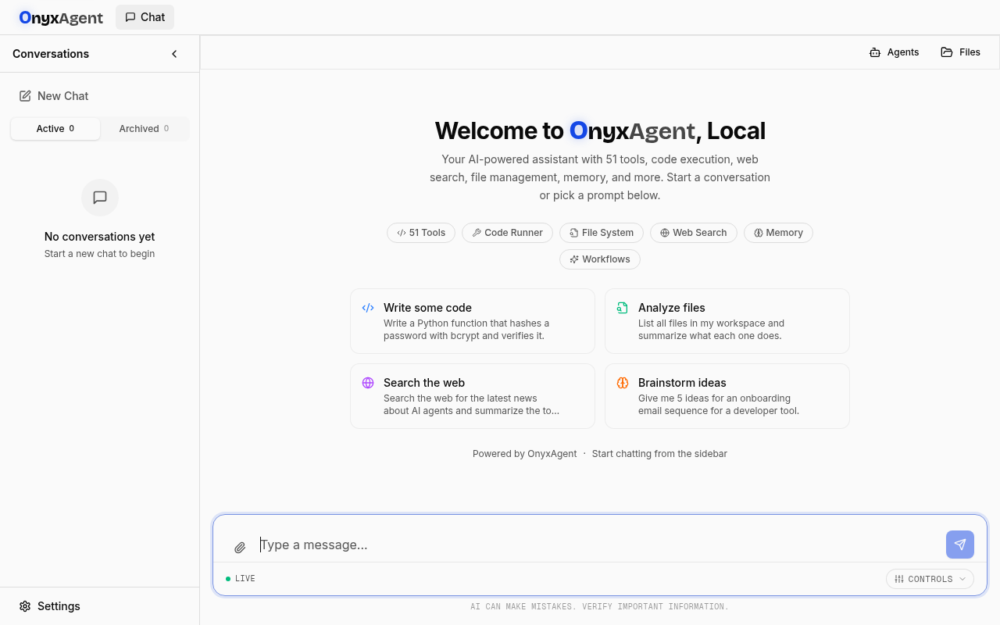
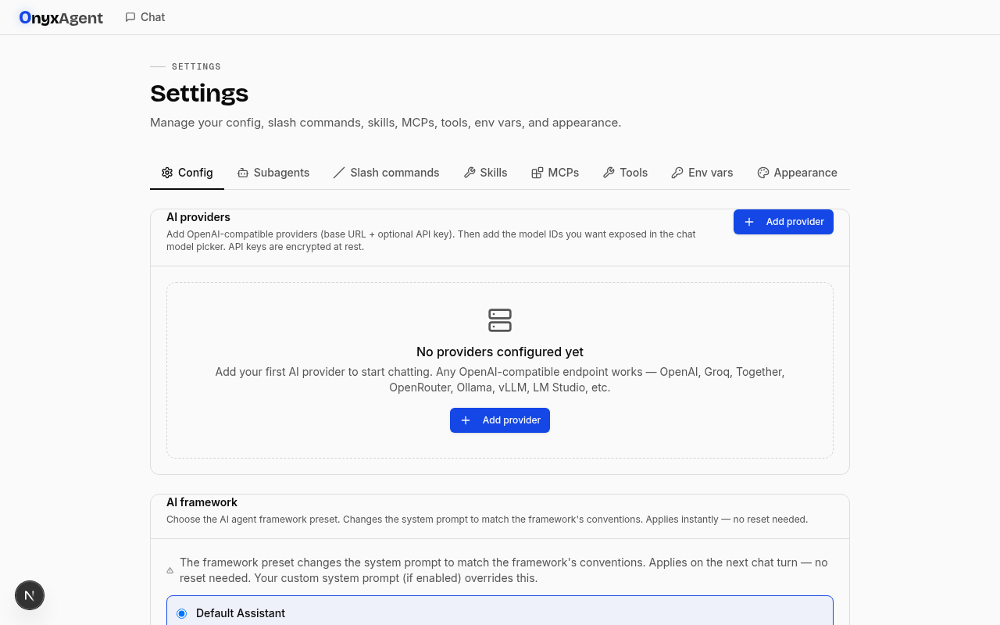
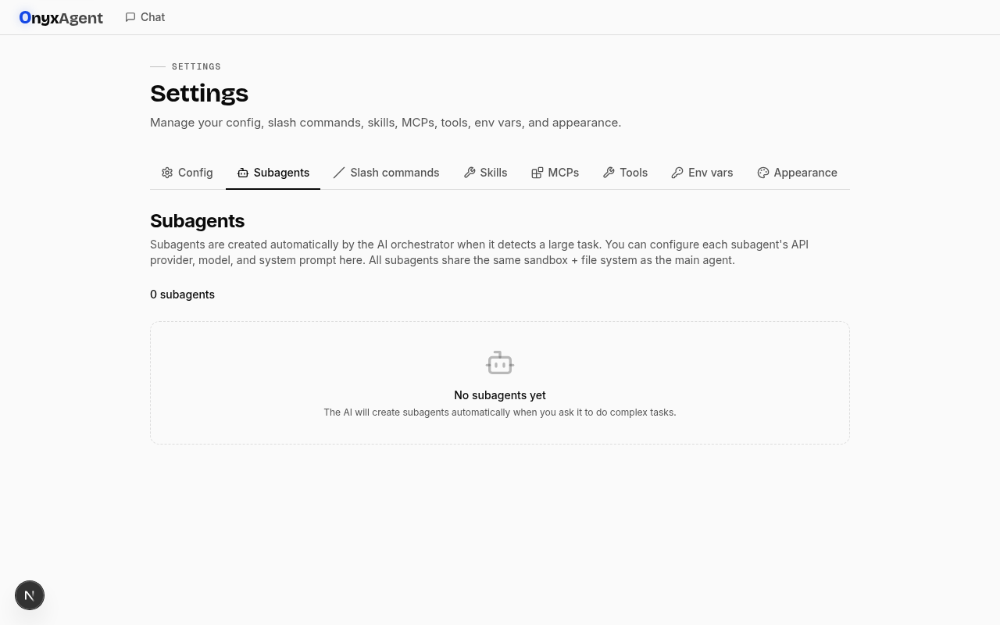
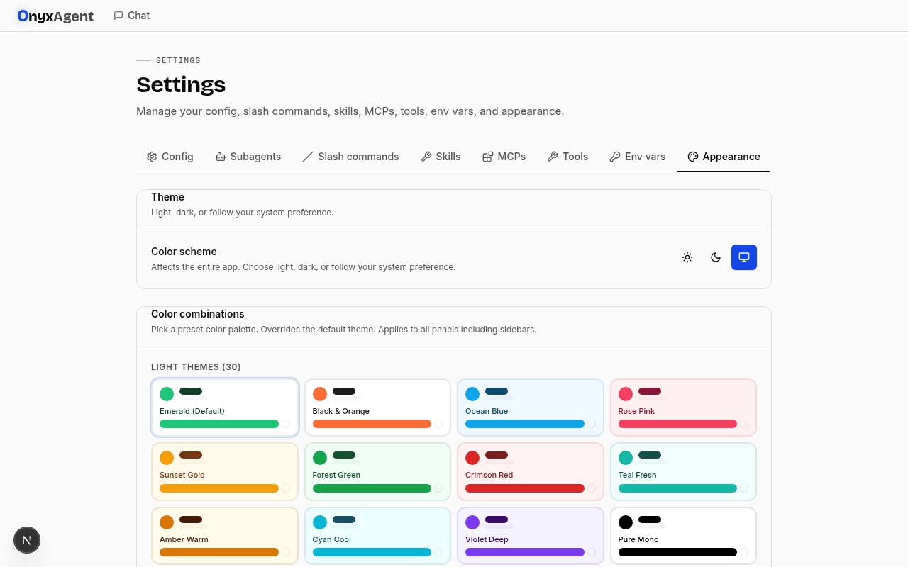
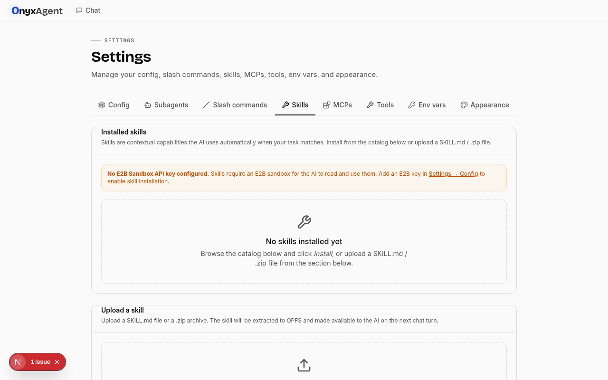
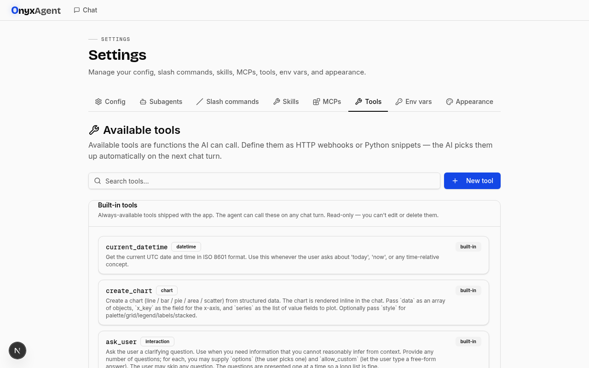
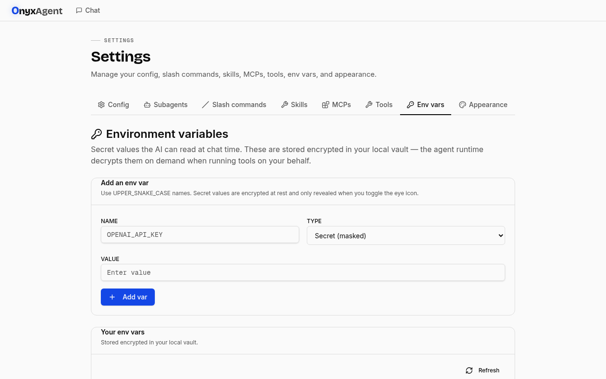
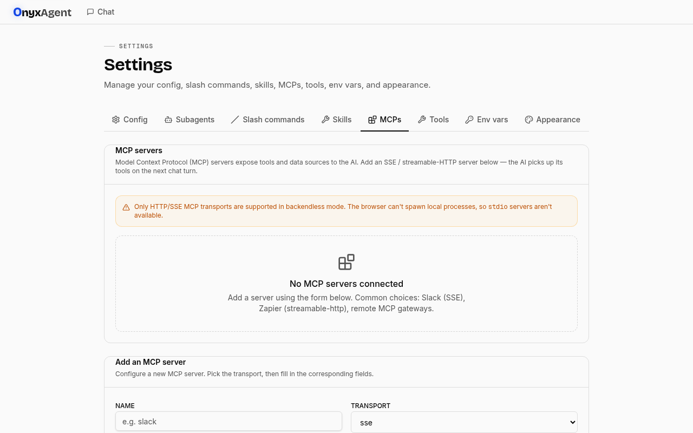
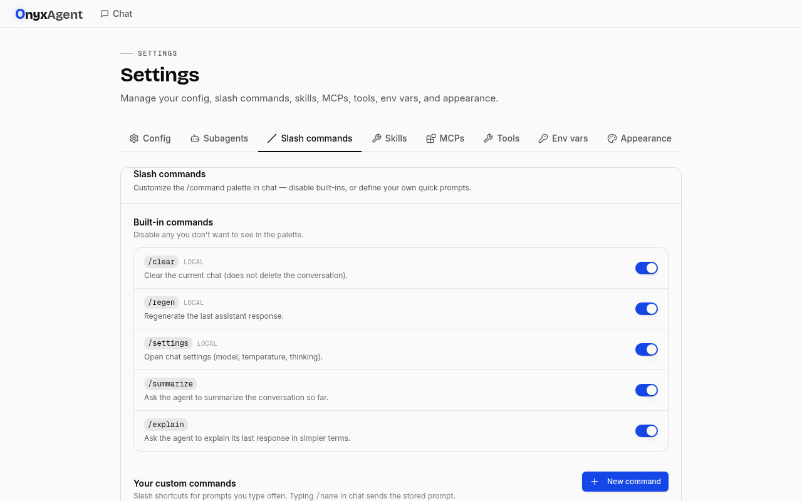

<div align="center">


### Frontend-Only AI Multi-Agent Chat Application

A fully client-side AI assistant with 50+ tools, multi-agent orchestration, real-time streaming, sandbox code execution, and a beautiful glassmorphic UI — all running in the browser with zero backend.

[](https://my-project-livid-zeta-99.vercel.app)
[](https://nextjs.org)
[](https://typescriptlang.org)
[](https://tailwindcss.com)

</div>

---

## ✨ Features

### 🤖 Multi-Agent Orchestration
- **AI-controlled subagent spawning** — the main AI acts as an orchestrator, creating specialized subagents (Researcher, Coder, Analyst, etc.) for complex tasks
- **Subagent chat sidebar** — chat directly with any subagent via `@name` tagging with autocomplete
- **Real streaming** — token-by-token streaming from subagent LLM calls with markdown rendering
- **Tool call cards** — collapsible, inline tool call cards (same as main chat)
- **Session persistence** — subagent chat history survives page refresh (localStorage)
- **Custom tools** — AI can create custom tools for subagents (e.g. meme generator, sentiment analyzer)
- **Shared sandbox** — all subagents share the same file system + tools as the main agent

### 💬 Chat Experience
- **Real-time streaming** with morphing geometric writing cursor (circle → triangle → square)
- **Full markdown rendering** — tables, task lists, code blocks, images, footnotes, kbd, definition lists
- **Thinking bar** — shows immediately on send, stays until AI generates its first character
- **Glassmorphic UI** — frosted glass surfaces, motion blur, shimmer loading, gradient borders
- **50+ animations** — staggered entrances, ripple taps, glow pulses, bounce-ins, slide+blur
- **Tool call cards** — inline collapsible cards for every tool call with args + results
- **Image preview** — AI can display images inline via `preview_image` tool
- **Chart rendering** — AI can create interactive charts inline via `create_chart` tool

### 🛠️ 50+ Built-in Tools
| Category | Tools |
|----------|-------|
| **Code Execution** | `run_python`, `run_terminal` (E2B sandbox) |
| **File Management** | `create_file`, `write_file`, `read_file`, `edit_file`, `delete_file`, `list_files`, `search_files`, `create_folder` |
| **Web & Search** | `ddg_search` (DuckDuckGo), `web_fetch` |
| **Subagent Orchestration** | `spawn_subagent`, `query_subagent`, `list_subagents`, `steer_subagent`, `complete_subagent`, `cancel_subagent`, `create_custom_tool`, `create_subagent_chat`, `delete_subagent_chat`, `edit_subagent_chat_title`, `pin_subagent_chat` |
| **Visualization** | `create_chart`, `preview_image` |
| **Memory & Knowledge** | `memory`, `e2b_rag` |
| **Utilities** | `datetime`, `todos`, `workflow`, `counterfactual`, `security_audit` |
| **Skills & MCP** | `skill_tools`, `mcp_tools`, `mcp_management`, `dynamic_tools` |

### 🎨 50 Color Combinations
- **30 light themes** — Emerald, Black & Orange, Ocean Blue, Rose Pink, Sunset Gold, and more
- **20 dark themes** — Midnight Purple, Carbon Black, Deep Space, Dark Emerald, and more
- Persist across refresh, override all UI elements (sidebars, popovers, cards, borders)

### 🔧 Settings
- **AI Provider Config** — add custom OpenAI-compatible providers with per-conversation model selection
- **Subagent Management** — configure API provider, model, system prompt per subagent
- **Skills** — install SkillsMP marketplace skills + upload custom `.zip`/`.md` files
- **MCP Servers** — connect to Model Context Protocol servers
- **Custom Tools** — define HTTP webhook or Python snippet tools
- **Environment Variables** — inject secrets into sandbox + tool calls
- **Slash Commands** — custom shortcuts + built-in toggles
- **Appearance** — 50 color schemes + theme toggle

### 📁 File System
- **OPFS storage** — files stored in browser's Origin Private File System (no backend)
- **File sidebar** — browse, upload, download, rename, delete files
- **Binary-safe** — files are read/written as Blobs (not text) to prevent UTF-8 corruption
- **Auto-sync** — workspace files sync to E2B sandbox before code execution
- **File manifest** — invisible `.onyxagent_files.json` tells the AI what files exist

---

## 📸 Screenshots

### Chat Interface


### Settings — Config (AI Providers)


### Settings — Subagents


### Settings — Appearance (50 Color Schemes)


### Settings — Skills


### Settings — Tools


### Settings — Environment Variables


### Settings — MCP Servers


### Settings — Slash Commands


---

## 🚀 Tech Stack

| Layer | Technology |
|-------|-----------|
| **Framework** | Next.js 16 (App Router, Turbopack) |
| **Language** | TypeScript 5 (strict mode) |
| **Styling** | Tailwind CSS 4 + shadcn/ui (New York) |
| **State** | Zustand (client) + TanStack Query (server) |
| **Database** | Dexie (IndexedDB) — backendless |
| **File Storage** | OPFS (Origin Private File System) |
| **Code Sandbox** | E2B (via server-side API route) |
| **AI** | OpenAI-compatible API (any provider) |
| **Auth** | Client-side (vault-encrypted, no server) |
| **Crypto** | AES-GCM 256 + PBKDF2 (Web Crypto API) |

---

## 🔧 Setup

1. **Clone & install:**
   ```bash
   git clone https://github.com/AkshayCoder48/OnyxAgent-frontend-ai-multi-agent.git
   cd OnyxAgent-frontend-ai-multi-agent
   bun install
   ```

2. **Run dev server:**
   ```bash
   bun run dev
   ```

3. **Configure:**
   - Go to Settings → Config
   - Add an AI provider (OpenAI-compatible base URL + API key + models)
   - Optionally add an E2B Sandbox API key for code execution

4. **Deploy to Vercel:**
   ```bash
   vercel --prod
   ```

---

## 🏗️ Architecture

```
┌─────────────────────────────────────────────────┐
│                  Browser (Client)                 │
│                                                   │
│  ┌──────────┐  ┌──────────┐  ┌────────────────┐ │
│  │ React UI │  │ Zustand  │  │  TanStack Query│ │
│  │ (Chat,   │  │ (Auth,   │  │  (Conversations│ │
│  │ Settings,│  │  Chat,   │  │   , Settings)  │ │
│  │ Sidebar) │  │  Subagent│  │                │ │
│  │          │  │  Stores) │  │                │ │
│  └────┬─────┘  └────┬─────┘  └───────┬────────┘ │
│       │              │                │           │
│  ┌────▼──────────────▼────────────────▼────────┐ │
│  │              Dexie (IndexedDB)               │ │
│  │  Users · Conversations · Messages · Files   │ │
│  │  Providers · Settings · Skills · MCPs       │ │
│  └───────────────────────┬─────────────────────┘ │
│                          │                        │
│  ┌───────────────────────▼─────────────────────┐ │
│  │              OPFS (File Storage)             │ │
│  │  users/<id>/workspace/  (files)             │ │
│  │  users/<id>/files/     (chat attachments)   │ │
│  │  users/<id>/skills/    (installed skills)   │ │
│  └───────────────────────┬─────────────────────┘ │
│                          │                        │
│  ┌───────────────────────▼─────────────────────┐ │
│  │         E2B Sandbox (via /api/sandbox)       │ │
│  │  Python execution · Terminal · File I/O     │ │
│  └─────────────────────────────────────────────┘ │
│                                                   │
│  ┌─────────────────────────────────────────────┐ │
│  │    AI Provider (OpenAI-compatible API)       │ │
│  │  Streaming SSE · Tool calling · Vision       │ │
│  └─────────────────────────────────────────────┘ │
└─────────────────────────────────────────────────┘
```

---

## 📜 License

MIT — free to use, modify, and distribute.

---

<div align="center">

**[Live Demo](https://my-project-livid-zeta-99.vercel.app)** · **[GitHub](https://github.com/AkshayCoder48/OnyxAgent-frontend-ai-multi-agent)**

Built with ❤️ using Next.js, Tailwind CSS, and Zustand

</div>
